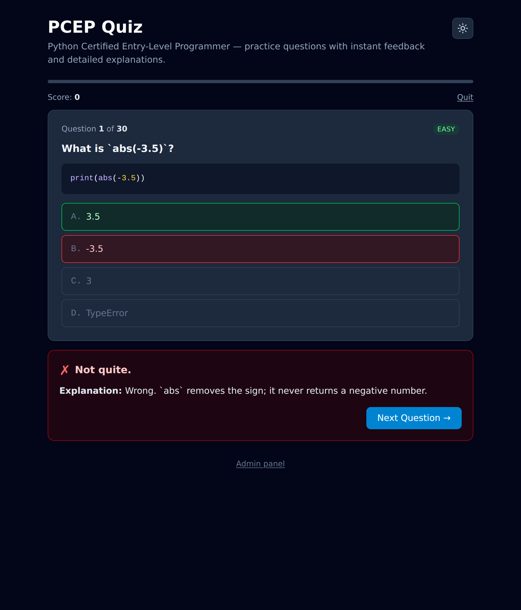
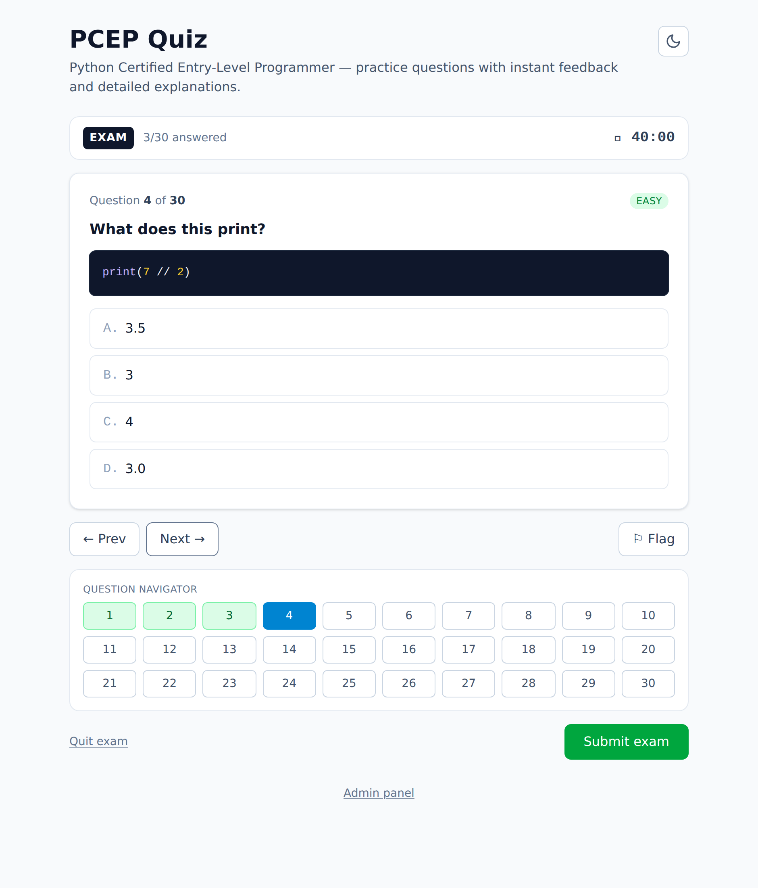
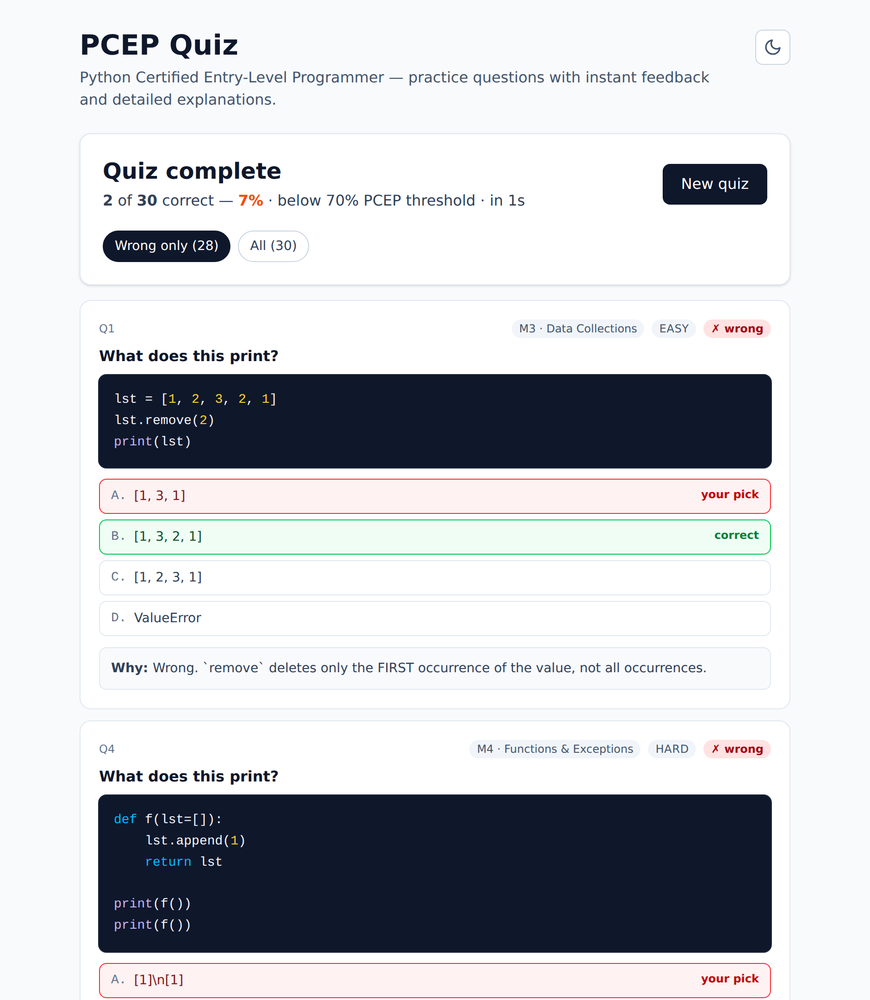
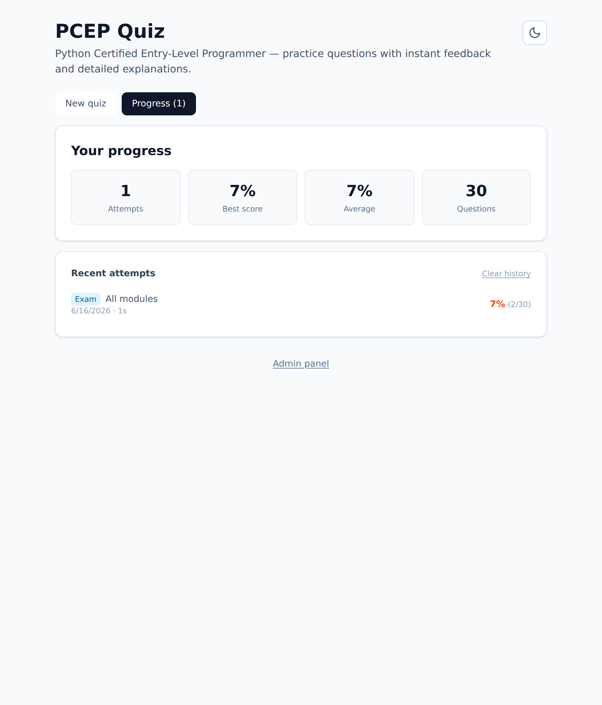

# PCEP Quiz

[](https://github.com/Alexandru2984/PCEP_webApp/actions/workflows/ci.yml)
[](LICENSE)
[](https://www.python.org/)
[](https://www.djangoproject.com/)
[](https://react.dev/)

A practice-quiz web app for the **PCEP™ — Certified Entry-Level Python Programmer**
certification. Every question gives instant feedback and a per-option explanation that
tells you _why_ each wrong answer is wrong — so you learn the concept, not just the key.

🔗 **Live:** [pcep.micutu.com](https://pcep.micutu.com)

> Questions are organised by the four official PCEP-30-02 syllabus modules and tagged by
> difficulty, so you can drill a weak area or take a full mixed mock exam.

## Screenshots

| Practice mode (dark)                                        | Exam simulation (light)                     |
| ----------------------------------------------------------- | ------------------------------------------- |
|  |  |

| Review & explanations                           | Progress dashboard                                    |
| ----------------------------------------------- | ----------------------------------------------------- |
|  |  |

## Features

- 📚 **150+ questions** across all four PCEP modules with syntax-highlighted code
- 🎯 **Per-option explanations** — wrong answers explain the exact misconception
- ⏱️ **Two modes** — Practice (instant feedback) and a timed **Exam simulation**
  with a question navigator, flagging, and auto-submit
- 🧩 **Filter by module & difficulty**, choose how many questions to take
- 📊 **Progress dashboard** — attempt history and per-module mastery (local-first)
- 📈 **End-of-quiz review** — see every question, filter to just the ones you missed
- ⌨️ **Keyboard shortcuts** and full dark mode
- 📱 **Installable PWA** with Open Graph share cards
- ✅ Scored against the official **70% pass threshold**
- 🔒 **Answer keys never leave the server** until you submit (no cheating via DevTools)
- 🛡️ Rate-limited API, hardened production settings, DB-backed health probe

## Tech stack

| Layer    | Tech                                                     |
| -------- | -------------------------------------------------------- |
| Backend  | Django 5 · Django REST Framework · PostgreSQL · Gunicorn |
| Frontend | React 18 · Vite · Tailwind CSS 4 · Axios                 |
| Tooling  | pytest · ESLint · Prettier · GitHub Actions CI           |
| Deploy   | Docker Compose · system Nginx · Let's Encrypt            |

## Architecture

```
Internet → system nginx (80/443) ──┬── /admin/, /api/ → 127.0.0.1:8001 (Docker: gunicorn)
                                   └── /               → /var/www/pcep/frontend (React build)
```

## Local development

### Backend

```bash
cd backend
python3 -m venv .venv && source .venv/bin/activate
pip install -r requirements-dev.txt

# Point Django at a local Postgres and seed the bank
export DJANGO_SECRET_KEY=dev DJANGO_DEBUG=True
export POSTGRES_HOST=localhost POSTGRES_DB=pcep_db POSTGRES_USER=pcep_user POSTGRES_PASSWORD=...
python manage.py migrate
python manage.py seed_questions          # add --reset to wipe first
python manage.py runserver
```

### Frontend

```bash
cd frontend
npm install
npm run dev        # Vite dev server, proxies /api to Django (see vite.config.js)
```

### With Docker

```bash
cp .env.example .env          # then fill in real secrets
docker compose up --build     # db + backend on 127.0.0.1:8001
docker compose --profile build run --rm frontend-builder   # build the React app
```

## Testing & quality

```bash
# Backend — 22 tests (API behaviour + seed-data integrity)
# Uses SQLite test settings locally; CI runs the same suite against PostgreSQL.
cd backend && python -m pytest

# Frontend — lint, format check, production build
cd frontend && npm run lint && npm run format:check && npm run build
```

CI runs all of the above on every push and pull request, plus
`manage.py check --deploy` against a production-like config.

## API reference

| Method | Endpoint                      | Description                                                                        |
| ------ | ----------------------------- | ---------------------------------------------------------------------------------- |
| `GET`  | `/api/health/`                | Liveness probe (200 only if the DB is reachable)                                   |
| `GET`  | `/api/quiz-set/`              | Random question set. Params: `count`, `module`, `difficulty`                       |
| `GET`  | `/api/questions/<id>/`        | Single question (choices only — no answer key)                                     |
| `POST` | `/api/questions/<id>/answer/` | Submit `{ "choice_id": N }`; returns correctness + explanation                     |
| `POST` | `/api/grade/`                 | Grade a batch: `{ "answers": [{ "question_id": N, "choice_id": M }] }` (exam mode) |

## Project layout

```
backend/     Django project + DRF quiz app, management commands, tests
frontend/    React + Vite + Tailwind app
nginx/       Template config for system nginx
.github/     CI workflow
docker-compose.yml
```

## License

[MIT](LICENSE) © Dragne Alexandru Mihai
