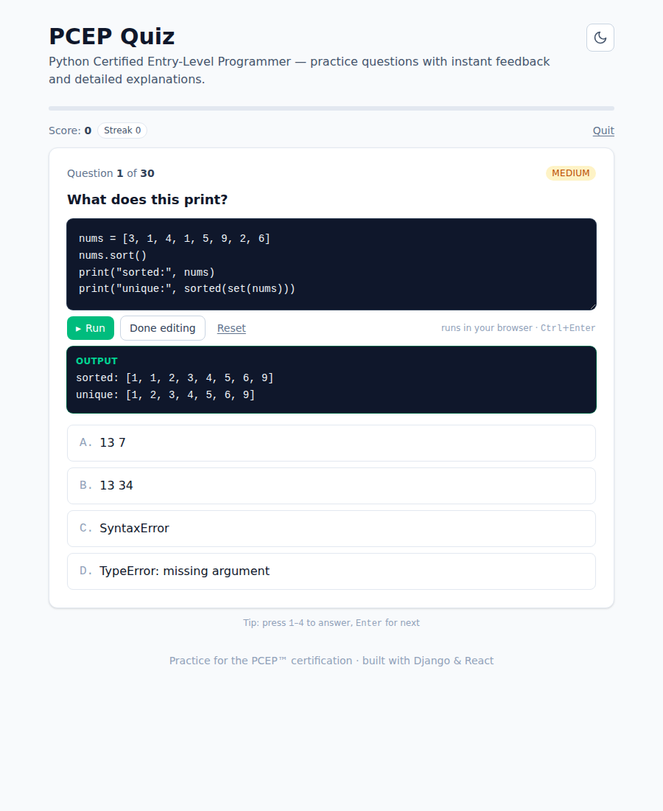
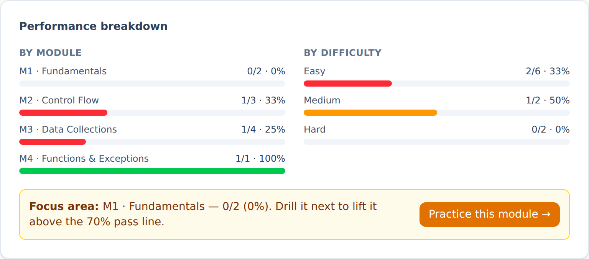
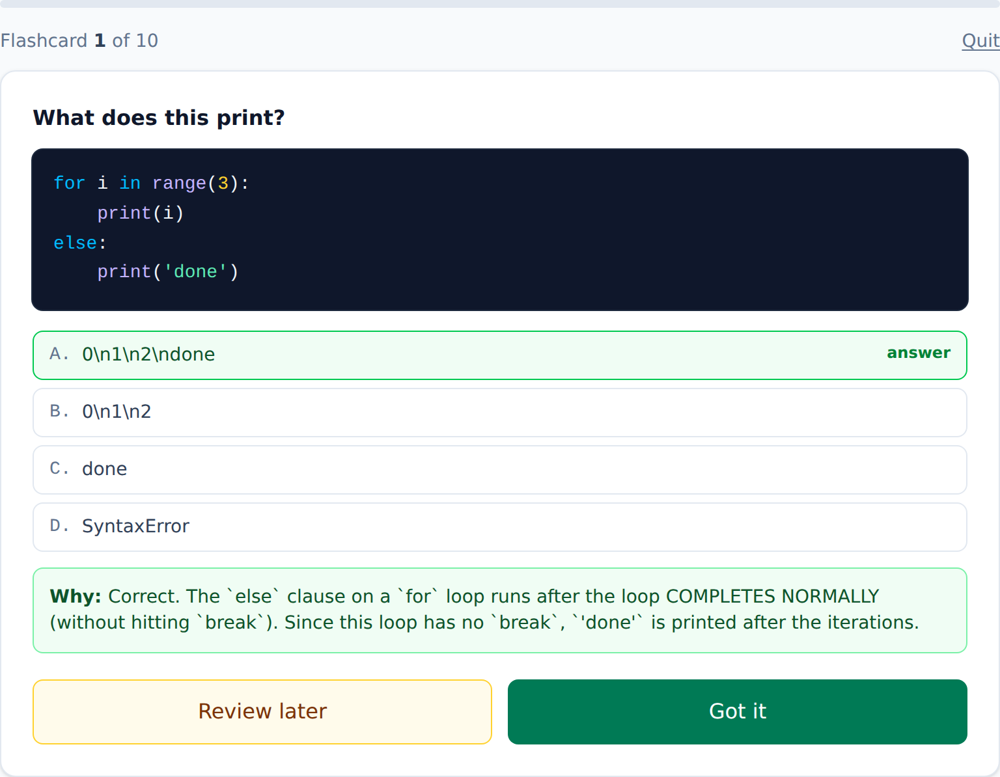

# PCEP Quiz

[](https://github.com/Alexandru2984/PCEP_webApp/actions/workflows/ci.yml)
[](LICENSE)
[](https://www.python.org/)
[](https://www.djangoproject.com/)
[](https://react.dev/)

A practice-quiz web app for the **PCEP™ — Certified Entry-Level Python Programmer**
certification. Every question gives instant feedback and a per-option explanation that
tells you _why_ each wrong answer is wrong — so you learn the concept, not just the key.

🔗 **Live:** [pcep.micutu.com](https://pcep.micutu.com)

> Questions are organised by the four official PCEP-30-02 syllabus modules and tagged by
> difficulty, so you can drill a weak area or take a full mixed mock exam.

## Screenshots

| Practice mode (dark)                                        | Exam simulation (light)                     |
| ----------------------------------------------------------- | ------------------------------------------- |
|  |  |

| Review & explanations                           | Progress dashboard                                    |
| ----------------------------------------------- | ----------------------------------------------------- |
|  |  |

| Run any snippet right in the question (Pyodide / WebAssembly) |
| ------------------------------------------------------------- |
|      |

| End-of-quiz report with one-click drills        | Flashcards study mode                                   |
| ----------------------------------------------- | ------------------------------------------------------- |
|  |  |

## Features

- 📚 **300+ questions** across all four PCEP modules with syntax-highlighted code
- 🐍 **Run the code, don't just read it** — every snippet has a built-in Python
  interpreter (Pyodide on WebAssembly). Edit it, hit **Run**, and see real
  `stdout`/tracebacks **entirely in your browser** — no backend, no server cost.
  Runaway loops are sandboxed in a Web Worker and killed on a timeout.
- 🎯 **Per-option explanations** — a wrong pick explains the exact misconception
  _and_ why the correct answer is right (skipped exam questions included)
- ⏱️ **Three study modes** — Practice (instant feedback), a timed **Exam
  simulation** (question navigator, flagging, auto-submit), and **Flashcards**
  (flip to reveal the answer, self-mark what you know)
- 🧩 **Filter by module & difficulty**, choose how many questions to take
- 📊 **Progress dashboard** — attempt history and per-module mastery (local-first)
- 📈 **End-of-quiz report** — per-module and per-difficulty breakdown with a
  "focus area" recommendation you can drill in one click, plus a question-by-question
  review filtered to misses
- 🔁 **Practice your mistakes** — missed questions are saved locally and re-served
  as a focused drill; answer one correctly and it drops off the list (local-first)
- ⌨️ **Keyboard shortcuts** and full dark mode
- 📱 **Installable, offline-capable PWA** — a service worker precaches the app
  shell and caches the Pyodide runtime, so it loads instantly on repeat visits and
  the shell works offline; Open Graph share cards too
- ✅ Scored against the official **70% pass threshold**
- 🔒 **Answer keys never leave the server** until you submit (no cheating via DevTools)
- 🛡️ Rate-limited API, hardened production settings, DB-backed health probe

## Tech stack

| Layer    | Tech                                                      |
| -------- | --------------------------------------------------------- |
| Backend  | Django 5 · Django REST Framework · PostgreSQL · Gunicorn  |
| Frontend | React 18 · Vite · Tailwind CSS 4 · Axios · Pyodide (WASM) |
| Tooling  | pytest · Vitest · ESLint · Prettier · GitHub Actions CI   |
| Deploy   | Docker Compose · system Nginx · Let's Encrypt             |

## Architecture

```
Internet → system nginx (80/443) ──┬── /admin/, /api/ → 127.0.0.1:8001 (Docker: gunicorn)
                                   └── /               → /var/www/pcep/frontend (React build)
```

## Local development

### Backend

```bash
cd backend
python3 -m venv .venv && source .venv/bin/activate
pip install -r requirements-dev.txt

# Point Django at a local Postgres and seed the bank
export DJANGO_SECRET_KEY=dev DJANGO_DEBUG=True
export POSTGRES_HOST=localhost POSTGRES_DB=pcep_db POSTGRES_USER=pcep_user POSTGRES_PASSWORD=...
python manage.py migrate
python manage.py seed_questions          # idempotent: adds missing questions
python manage.py runserver
```

### Frontend

```bash
cd frontend
npm install
npm run fetch-pyodide   # one-time: downloads the self-hosted Python runtime (~12 MB,
                        # git-ignored) used by the in-browser code runner
npm run dev             # Vite dev server, proxies /api to Django (see vite.config.js)
```

> The build succeeds without the Pyodide step, but the **Run** button needs it.
> `npm run build` copies `public/pyodide/` into `dist/`, so it ships same-origin
> at `/pyodide/*` — no third-party CDN, and the CSP only needs `'wasm-unsafe-eval'`.

### With Docker

```bash
cp .env.example .env          # then fill in real secrets
docker compose up --build     # db + backend on 127.0.0.1:8001
docker compose --profile build run --rm frontend-builder   # build the React app
```

## Testing & quality

Lighthouse on the live site (desktop): **Performance 99 · Accessibility 100 ·
SEO 100 · Best Practices 92**. Accessibility is verified with axe-core (zero
violations across setup, quiz, and dashboard). The Best-Practices gap is entirely
Cloudflare-injected scripts (the Web Analytics beacon and Rocket Loader) that the
strict CSP intentionally blocks — turning those two off in the Cloudflare dashboard
takes it to 100 without weakening the policy.

```bash
make test
make audit
make django-check

# Backend — 31 tests (API behaviour + seed-data integrity)
# Uses SQLite test settings locally; CI runs the same suite against PostgreSQL.
cd backend && python -m pytest
DJANGO_SETTINGS_MODULE=pcep_project.test_settings python manage.py audit_questions

# Frontend — 36 Vitest unit tests (scoring/streak/storage/stats logic plus
# component tests for the feedback box, score summary and the end-of-quiz
# report), then lint, format check, and the production build.
cd frontend && npm run test && npm run lint && npm run format:check && npm run build
```

CI runs all of the above on every push and pull request, plus
`manage.py check --deploy` against a production-like config.

Operational deploy and rollback notes live in [docs/OPERATIONS.md](docs/OPERATIONS.md).

## API reference

| Method | Endpoint                      | Description                                                                          |
| ------ | ----------------------------- | ------------------------------------------------------------------------------------ |
| `GET`  | `/api/health/`                | Liveness probe (200 only if the DB is reachable)                                     |
| `GET`  | `/api/quiz-set/`              | Random question set. Params: `count`, `module`, `difficulty`                         |
| `GET`  | `/api/questions/<id>/`        | Single question (choices only — no answer key)                                       |
| `POST` | `/api/questions/<id>/answer/` | Submit `{ "choice_id": N }`; returns correctness + the picked & correct explanations |
| `POST` | `/api/grade/`                 | Grade a batch: `{ "answers": [{ "question_id": N, "choice_id": M }] }` (exam mode)   |

## Project layout

```
backend/     Django project + DRF quiz app, management commands, tests
frontend/    React + Vite + Tailwind app
nginx/       Template config for system nginx
.github/     CI workflow
docker-compose.yml
```

## License

[MIT](LICENSE) © Dragne Alexandru Mihai
