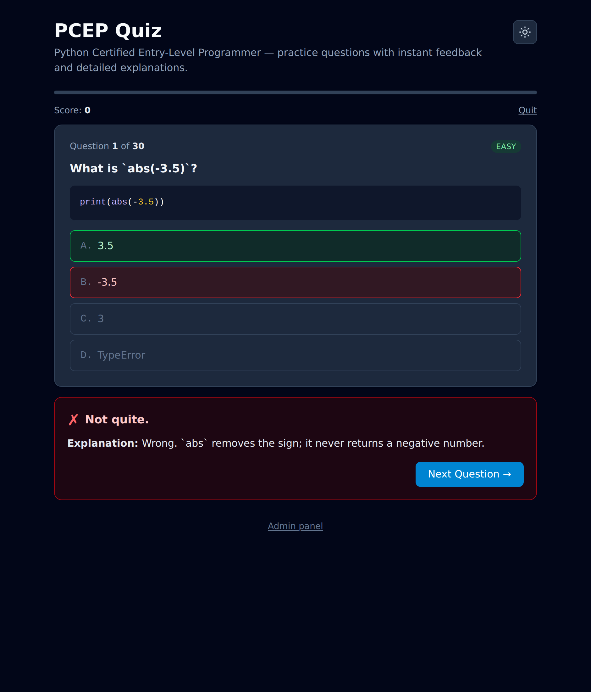
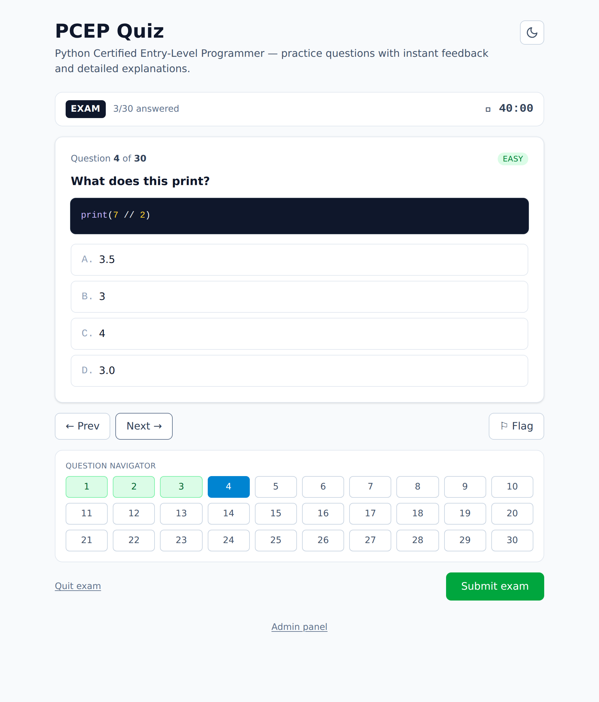
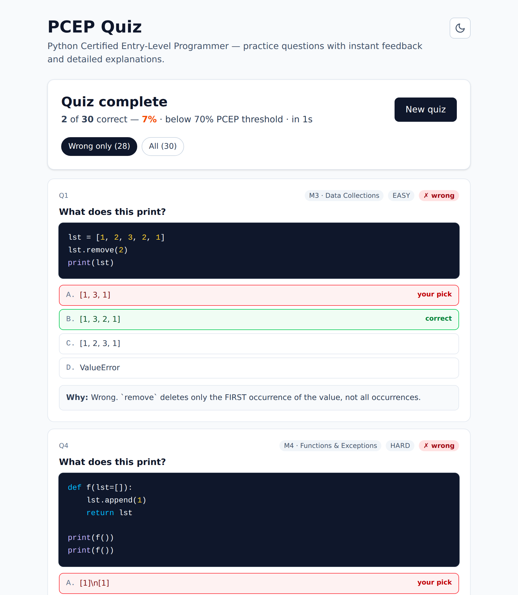
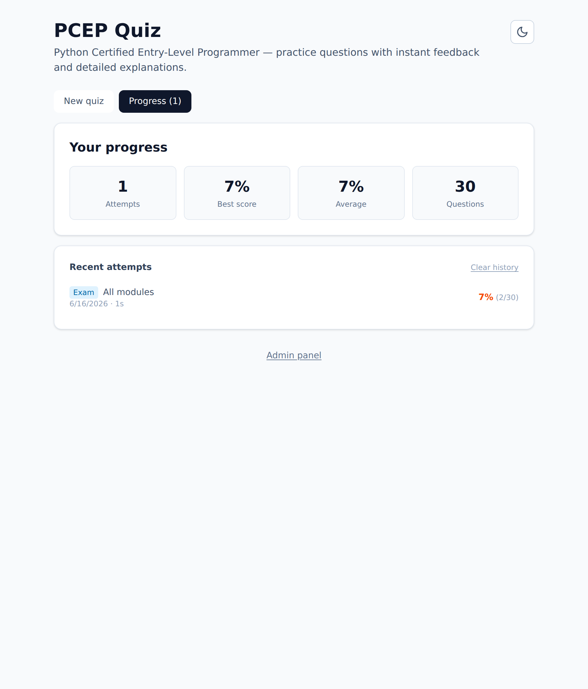
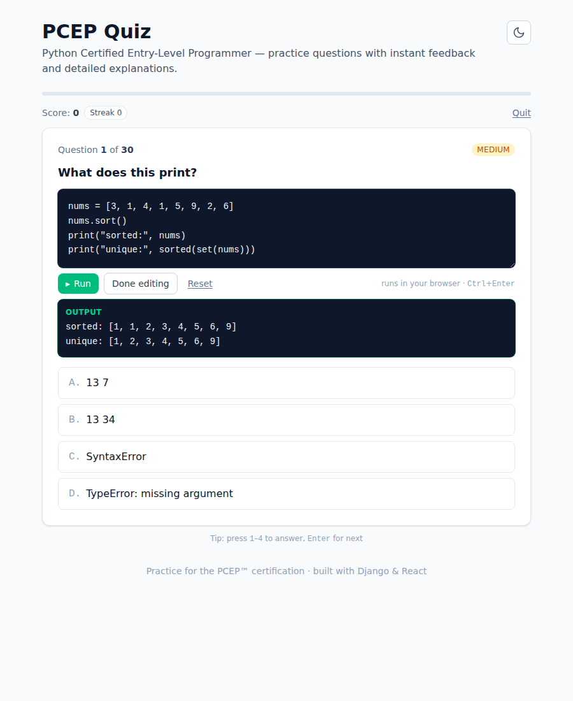
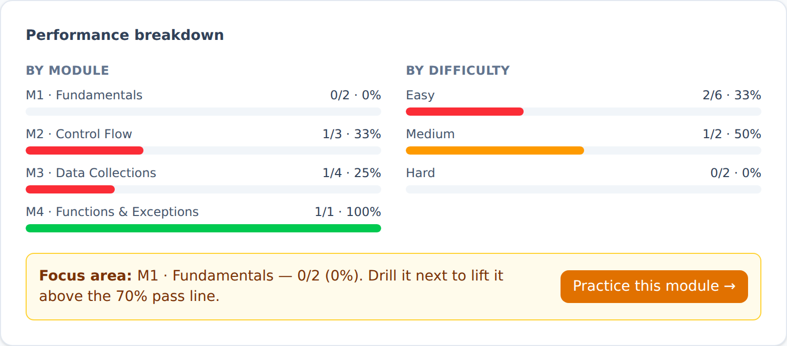
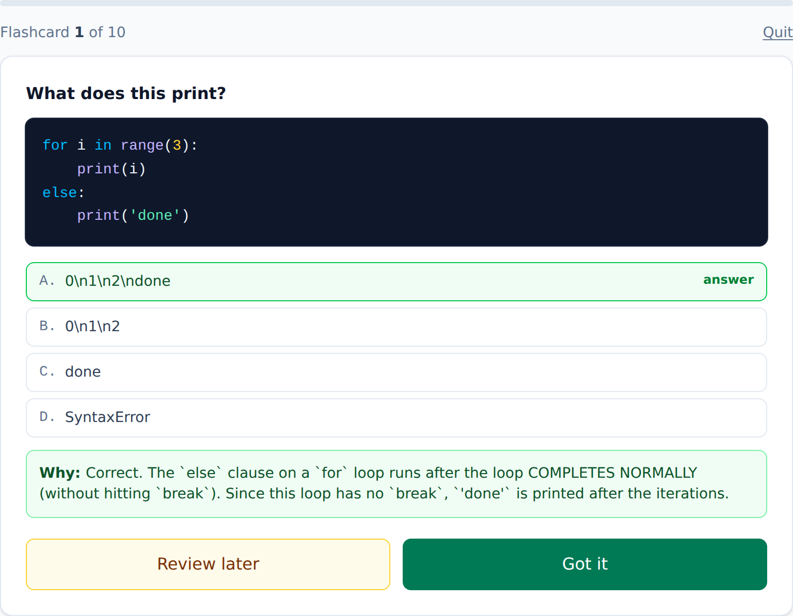

# PCEP Quiz

[](https://github.com/Alexandru2984/PCEP_webApp/actions/workflows/ci.yml)
[](LICENSE)
[](https://www.python.org/)
[](https://www.djangoproject.com/)
[](https://react.dev/)

A practice-quiz web app for the **PCEP™ — Certified Entry-Level Python Programmer**
certification. Every question gives instant feedback and a per-option explanation that
tells you _why_ each wrong answer is wrong — so you learn the concept, not just the key.

🔗 **Live:** [pcep.micutu.com](https://pcep.micutu.com)

> Questions are organised by the four official PCEP-30-02 syllabus modules and tagged by
> difficulty, so you can drill a weak area or take a full mixed mock exam.

## Screenshots

| Practice mode (dark)                                        | Exam simulation (light)                     |
| ----------------------------------------------------------- | ------------------------------------------- |
|  |  |

| Review & explanations                           | Progress dashboard                                    |
| ----------------------------------------------- | ----------------------------------------------------- |
|  |  |

| Run any snippet right in the question (Pyodide / WebAssembly) |
| ------------------------------------------------------------- |
|      |

| End-of-quiz report with one-click drills        | Flashcards study mode                                   |
| ----------------------------------------------- | ------------------------------------------------------- |
|  |  |

## Features

- 📚 **300+ questions** across all four PCEP modules with syntax-highlighted code
- 🐍 **Run the code, don't just read it** — every snippet has a built-in Python
  interpreter (Pyodide on WebAssembly). Edit it, hit **Run**, and see real
  `stdout`/tracebacks **entirely in your browser** — no backend, no server cost.
  Each run is isolated in a replaceable Web Worker with startup, execution,
  source, queue and output limits. This protects responsiveness; it is not a
  security sandbox for hostile code.
- 🎯 **Per-option explanations** — a wrong pick explains the exact misconception
  _and_ why the correct answer is right (skipped exam questions included)
- ⏱️ **Three study modes** — Practice (instant feedback), a timed **Exam
  simulation** (question navigator, flagging, auto-submit), and **Flashcards**
  (flip to reveal the answer, self-mark what you know)
- 💾 **Crash-safe exam recovery** — an interrupted exam restores its deadline,
  current question, selected answers and flags from a validated local-only copy
- 🧠 **Local review schedule** — an explainable 1, 3, 7, 14… day study cycle,
  due-review drills, per-question mastery and transparent adaptive practice that also
  prioritizes low-confidence answers, without accounts or tracking
- 🧩 **Filter by module & difficulty**, choose how many questions to take
- 🔎 **Search question text or Python code** and build a focused practice drill from
  up to 20 matches; search previews deliberately exclude choices and answer metadata
- 📊 **Progress dashboard** — bounded attempt history, weighted module/difficulty
  accuracy, confidence calibration, local-day study streaks, score trends, measured
  response pace and separate flashcard self-ratings (local-first)
- 📈 **End-of-quiz report** — per-module, per-difficulty and optional confidence
  breakdowns, decision timing and a "focus area" recommendation you can drill in one
  click, plus a question-by-question review filtered to misses
- 🔁 **Practice your mistakes** — missed questions are saved locally and re-served
  as a focused drill; answer one correctly and it drops off the list (local-first)
- 🔖 **Bookmarks and portable progress** — bookmark drills plus validated,
  versioned JSON export/import and selective history, review, mistake, note and bookmark resets
- 📝 **Private personal notes** — keep bounded local notes beside practice questions and
  review them after a session; notes are included in validated progress backups
- ⌨️ **Keyboard shortcuts** and full dark mode
- 📱 **Installable, offline-capable PWA** — a service worker precaches the public
  shell and caches the Pyodide runtime. API answers and study pages are excluded;
  offline mode never downloads the answer bank.
- ✅ Scored against the official **70% pass threshold**
- 🔒 **Answer keys never leave the server** until you submit (no cheating via DevTools)
- 🛡️ Rate-limited API, hardened production settings, separate process liveness
  and database readiness probes

## Tech stack

| Layer    | Tech                                                      |
| -------- | --------------------------------------------------------- |
| Backend  | Django 5.2 LTS · Django REST Framework · PostgreSQL · Gunicorn |
| Frontend | React 18 · Vite · Tailwind CSS 4 · Axios · Pyodide (WASM) |
| Tooling  | pytest · Vitest · ESLint · Prettier · GitHub Actions CI   |
| Deploy   | Docker Compose · system Nginx · Cloudflare Tunnel · Let's Encrypt |

## Architecture

```
Internet → Cloudflare → cloudflared → HTTPS loopback Nginx
                                      ├── /admin/, /api/ → 127.0.0.1:8001
                                      │                   → Docker: Gunicorn → PostgreSQL
                                      ├── /practice/      → generated public study pages
                                      └── /               → /var/www/pcep/frontend
```

## Local development

### Backend

```bash
cd backend
python3 -m venv .venv && source .venv/bin/activate
pip install -r requirements-dev.txt

# Point Django at a local Postgres and seed the bank
export DJANGO_SECRET_KEY=dev DJANGO_DEBUG=True
export POSTGRES_HOST=localhost POSTGRES_DB=pcep_db POSTGRES_USER=pcep_user POSTGRES_PASSWORD=...
python manage.py migrate
python manage.py seed_questions          # idempotent: adds missing questions
python manage.py runserver
```

### Frontend

```bash
cd frontend
npm ci
npm run fetch-pyodide   # one-time: downloads the self-hosted Python runtime (~12 MB,
                        # git-ignored) used by the in-browser code runner
npm run dev             # Vite dev server, proxies /api to Django (see vite.config.js)
```

> The build succeeds without the Pyodide step, but the **Run** button needs it.
> `npm run build` copies `public/pyodide/` into `dist/`, so it ships same-origin
> at `/pyodide/*` — no third-party CDN, and the CSP only needs `'wasm-unsafe-eval'`.

### With Docker

```bash
cp .env.example .env          # then fill in real secrets
docker compose up --build     # db + backend on 127.0.0.1:8001
docker compose --profile build run --rm frontend-builder   # build the React app
```

## Testing & quality

The browser suite checks setup, practice, exam, review, progress, flashcards,
offline recovery and the real Pyodide runtime. Axe and horizontal-overflow checks
cover both themes at 1440, 1280, 1024, 768, 430, 390 and 360 px. These automated
checks supplement manual review; they are not a blanket accessibility certification.

```bash
make test
make audit
make django-check

# Backend — 119 tests (API/security, integrity, startup, release and SEO behavior)
# Local tests use in-memory SQLite; CI also runs the API suite against PostgreSQL.
cd backend && python -m pytest
DJANGO_SETTINGS_MODULE=pcep_project.test_settings python manage.py audit_questions --fail-on-warnings
# Add --show-similar for conservative near-duplicate candidates requiring human review.

# Frontend — 155 Vitest tests, then static checks, the production build and
# 19 Playwright flows (including axe, confidence, PWA, notes, search, scheduled review,
# exam resume and Pyodide).
cd frontend && npm run test && npm run lint && npm run format:check && npm run build
cd frontend && npm run e2e
```

CI runs all of the above on every push and pull request, plus
`manage.py check --deploy` against a production-like config.

Operational deploy and rollback notes live in [docs/OPERATIONS.md](docs/OPERATIONS.md).

## API reference

| Method | Endpoint                      | Description                                                                          |
| ------ | ----------------------------- | ------------------------------------------------------------------------------------ |
| `GET`  | `/api/live/`                  | Process liveness; deliberately independent of PostgreSQL                              |
| `GET`  | `/api/health/`                | Readiness; returns 200 only if PostgreSQL is reachable                                |
| `GET`  | `/api/stats/`                 | Aggregate question coverage, without question or answer data                          |
| `GET`  | `/api/search/`                | Search text/code; bounded summary results without choices or answer metadata          |
| `GET`  | `/api/quiz-set/`              | Random public question set. Params: `count`, `module`, `difficulty`, bounded `ids`    |
| `GET`  | `/api/questions/<id>/`        | Single question (choices only — no answer key)                                       |
| `POST` | `/api/questions/<id>/answer/` | Submit `{ "choice_id": N }`; returns correctness + the picked & correct explanations |
| `POST` | `/api/grade/`                 | Grade 1–100 unique questions; null choices count as unanswered                        |

## Project layout

```
backend/     Django project + DRF quiz app, management commands, tests
frontend/    React + Vite + Tailwind app
nginx/       Production vhost and security/proxy header snippets
scripts/     Atomic publishers, Nginx validation and public study-page generator
.github/     CI workflow
docker-compose.yml
```

## License

[MIT](LICENSE) © Dragne Alexandru Mihai
