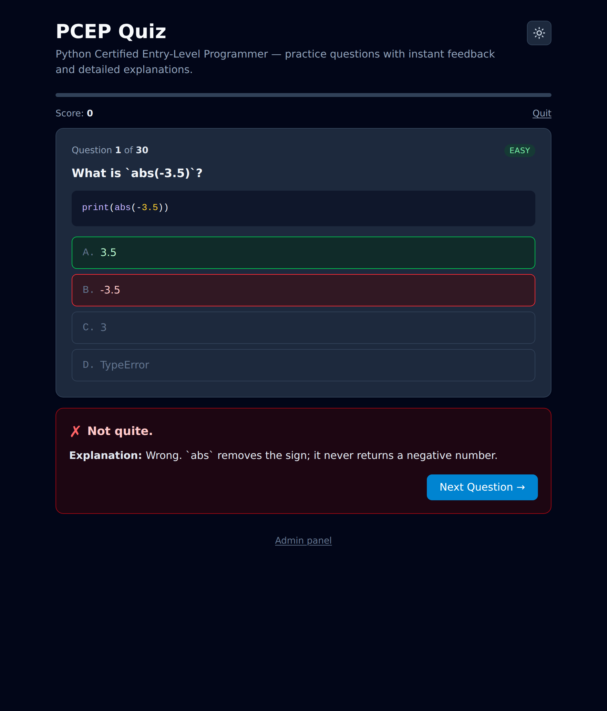
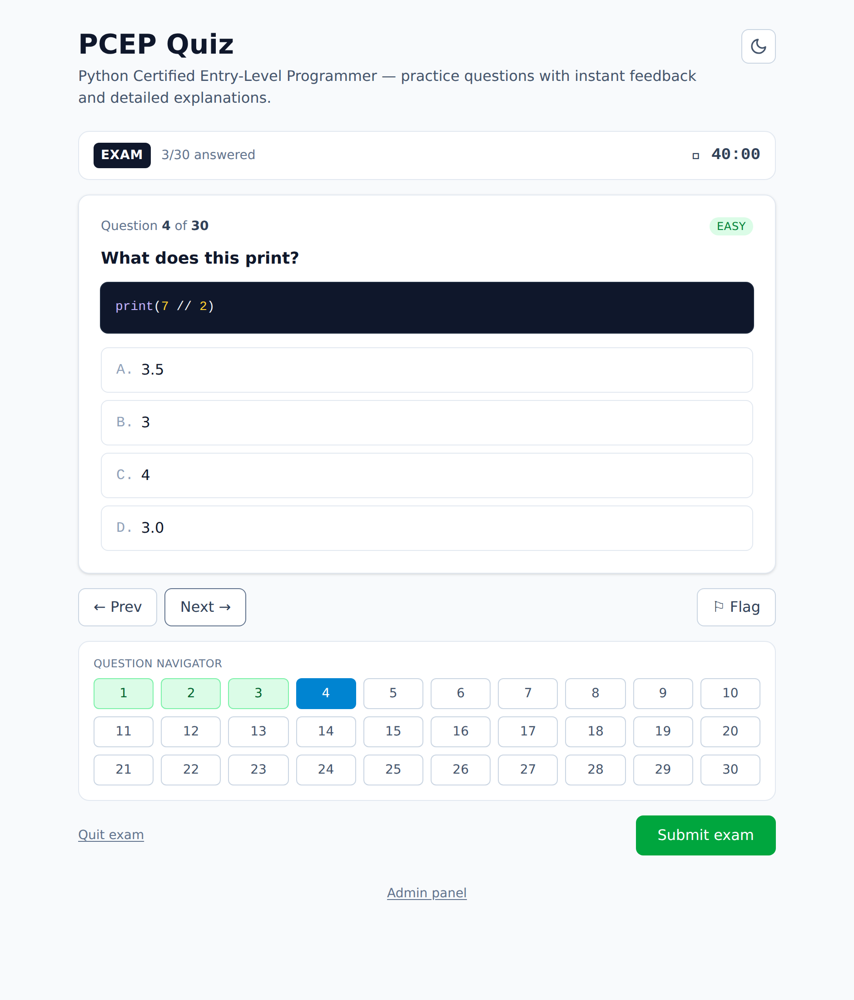
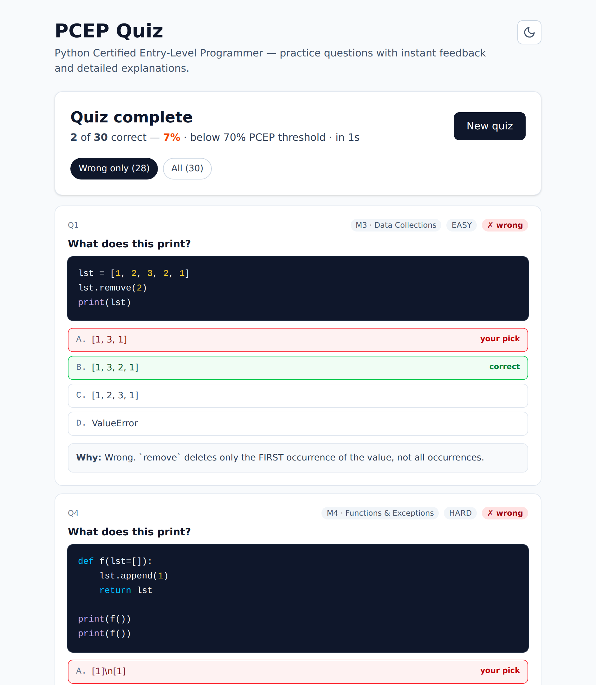
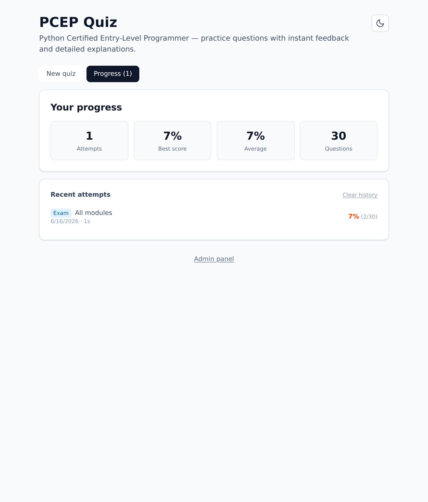
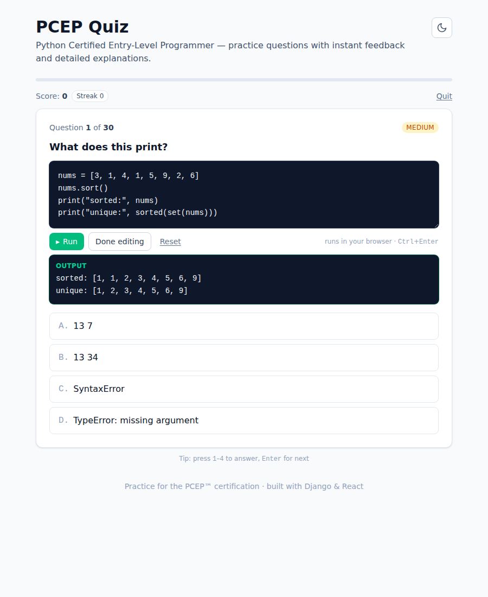
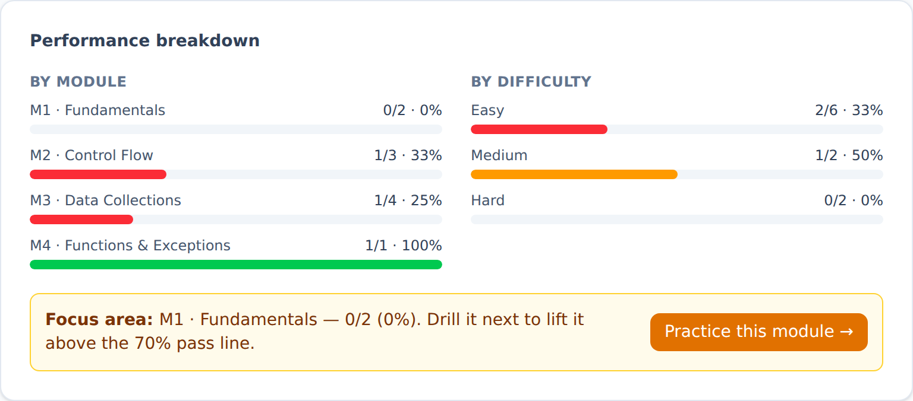
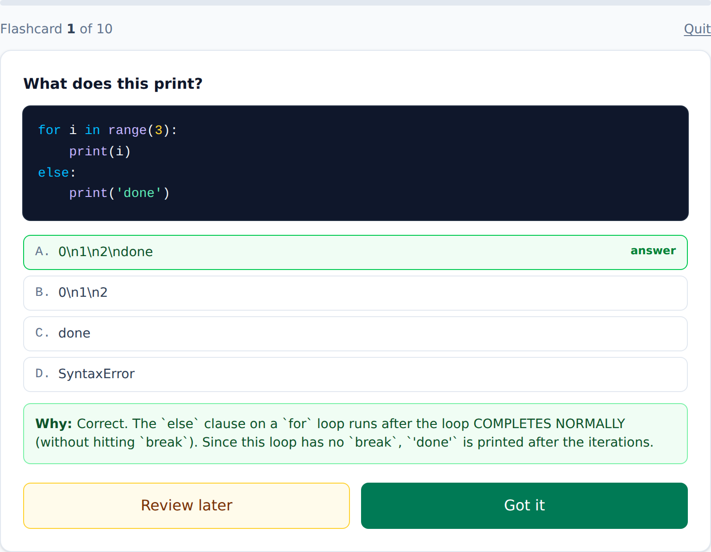

# PCEP Quiz

[](https://github.com/Alexandru2984/PCEP_webApp/actions/workflows/ci.yml)
[](https://github.com/Alexandru2984/PCEP_webApp/actions/workflows/production-smoke.yml)
[](LICENSE)
[](https://www.python.org/)
[](https://www.djangoproject.com/)
[](https://react.dev/)

A practice-quiz web app for the **PCEP™ — Certified Entry-Level Python Programmer**
certification. Every question gives instant feedback and a per-option explanation that
tells you _why_ each wrong answer is wrong — so you learn the concept, not just the key.

🔗 **Live:** [pcep.micutu.com](https://pcep.micutu.com)

> Questions are organised by the four official PCEP-30-02 syllabus modules, all 15
> objectives and difficulty, so you can drill a precise weak area or take a full mixed
> mock exam.

## Screenshots

| Practice mode (dark)                                        | Exam simulation (light)                     |
| ----------------------------------------------------------- | ------------------------------------------- |
|  |  |

| Review & explanations                           | Progress dashboard                                    |
| ----------------------------------------------- | ----------------------------------------------------- |
|  |  |

| Run any snippet right in the question (Pyodide / WebAssembly) |
| ------------------------------------------------------------- |
|      |

| End-of-quiz report with one-click drills        | Flashcards study mode                                   |
| ----------------------------------------------- | ------------------------------------------------------- |
|  |  |

## Features

- 📚 **300+ questions** across all four PCEP modules with syntax-highlighted code
- 🐍 **Run the code, don't just read it** — every snippet has a built-in Python
  interpreter (Pyodide on WebAssembly). Edit it, hit **Run**, and see real
  `stdout`/tracebacks **entirely in your browser** — no backend, no server cost.
  Each run is isolated in a replaceable Web Worker with startup, execution,
  source, queue and output limits. This protects responsiveness; it is not a
  security sandbox for hostile code.
- 🎯 **Per-option explanations** — a wrong pick explains the exact misconception
  _and_ why the correct answer is right (skipped exam questions included)
- ⏱️ **Three study modes** — Practice (instant feedback), a timed **Exam
  simulation** (question navigator, flagging, auto-submit), and **Flashcards**
  (flip to reveal the answer, self-mark what you know). Reveal failures are retryable,
  and leaving the deck cancels pending work. Exam mode includes a
  [PCEP-30-02](https://pythoninstitute.org/pcep) full-mock preset with 30 questions,
  40 minutes and the official 7/8/7/8 module item distribution; the UI clearly notes
  that this trainer does not reproduce the official interactive item formats.
- 💾 **Crash-safe session recovery** — an interrupted exam restores its live deadline,
  selections and flags, Practice resumes at the current question or already submitted
  feedback, and Flashcards restores the current card plus any answer already revealed.
  Every mode uses a validated local-only copy, requires confirmation before discard and
  keeps answer keys out of every unanswered or unrevealed question. A completed session
  reaches its report only after the progress snapshot is stored and its recovery copy is
  removed; a failed step remains retryable without counting the same session twice.
- 🧠 **Local review schedule** — an explainable 1, 3, 7, 14… day study cycle,
  due-review drills in Practice or Flashcards, per-question mastery and transparent
  adaptive study in Practice or Flashcards that also prioritizes low-confidence
  answers, without accounts or tracking. Saved mistakes and bookmarks can also be
  studied as graded Practice or self-rated Flashcard decks.
- 📅 **Daily challenge** — five deterministic questions with all four syllabus modules,
  a local completion score and the same answer-safe set throughout the Bucharest day
- 🧩 **Filter by module, syllabus objective & difficulty**, then choose a quick 5-question
  drill or a 10, 20, 30 or 50-question session
- 🔎 **Search question text or Python code** and build a focused Practice or Flashcard
  drill from up to 20 matches; search previews deliberately exclude choices and answer
  metadata
- 📊 **Progress dashboard** — bounded attempt history, weighted module/objective/
  difficulty accuracy, confidence calibration, local-day study streaks, score trends,
  measured response pace, separate full-mock history and separate flashcard self-ratings
  in both reports and history (local-first)
- 📈 **End-of-quiz report** — per-module, per-objective, per-difficulty and optional
  confidence breakdowns, decision timing and a precise "focus area" recommendation you
  can drill in one click, plus a focused review queue combining misses with correct
  answers given at low confidence; launch that exact queue immediately as graded
  Practice or self-rated Flashcards
- 🔁 **Practice your mistakes** — missed questions are saved locally and re-served
  as a focused Practice or Flashcard drill; a correct/self-rated success removes the
  question from the list (local-first)
- 🔖 **Bookmarks and portable progress** — Practice and Flashcard bookmark drills plus validated,
  versioned JSON export/import and selective history, review, mistake, note and bookmark resets
- 📝 **Private personal notes** — keep bounded local notes beside practice questions and
  review them after a session; notes are included in validated progress backups
- ⌨️ **Keyboard shortcuts** and full dark mode
- 📱 **Installable, offline-capable PWA** — eligible browsers offer a clear in-app
  install action; a service worker precaches the public shell and caches the Pyodide
  runtime. API answers and study pages are excluded, and the UI explains that new
  questions and feedback still need a connection. Offline mode never downloads the
  answer bank. App-shell updates wait for a learner-approved reload so an active exam
  is not replaced mid-session.
- ✅ Scored against the official **70% pass threshold**
- 🔒 **Answer keys never leave the server** until you submit (no cheating via DevTools)
- 🛡️ Rate-limited API, hardened production settings, separate process liveness
  and database readiness probes, plus scheduled read-only production contract
  monitoring without learner telemetry
- 🛡️ Non-root, read-only application and PostgreSQL containers with dropped
  capabilities, bounded resources, digest-pinned bases and blocking image scans
- 🔎 AST-backed question audits catch duplicates, malformed answer sets, short or
  editorial explanations, missing/cross-module objectives and out-of-syllabus syntax
  before release; PostgreSQL also rejects a second correct choice for one question

## Tech stack

| Layer    | Tech                                                              |
| -------- | ----------------------------------------------------------------- |
| Backend  | Django 5.2 LTS · Django REST Framework · PostgreSQL · Gunicorn    |
| Frontend | React 18 · Vite · Tailwind CSS 4 · Axios · Pyodide (WASM)         |
| Tooling  | pytest · Vitest · ESLint · Prettier · GitHub Actions CI/smoke     |
| Deploy   | Docker Compose · system Nginx · Cloudflare Tunnel · Let's Encrypt |

## Architecture

```
Internet → Cloudflare → cloudflared → HTTPS loopback Nginx
                                      ├── /admin/, /api/ → 127.0.0.1:8001
                                      │                   → Docker: Gunicorn → PostgreSQL
                                      ├── /practice/      → generated public study pages
                                      └── /               → /var/www/pcep/frontend
```

## Local development

### Backend

```bash
cd backend
python3 -m venv .venv && source .venv/bin/activate
pip install --require-hashes --only-binary=:all: -r requirements-dev.lock

# Point Django at a local Postgres and seed the bank
export DJANGO_SECRET_KEY=dev DJANGO_DEBUG=True
export POSTGRES_HOST=localhost POSTGRES_DB=pcep_db POSTGRES_USER=pcep_user POSTGRES_PASSWORD=...
python manage.py migrate
python manage.py seed_questions          # idempotent: adds missing questions
python manage.py runserver
```

### Frontend

Use Node 24.21.0 with npm 11.19.0. The project rejects unreviewed dependency
lifecycle scripts: only the exact reviewed `esbuild` installer is allowed, while
the optional `fsevents` installer is explicitly disabled.

```bash
cd frontend
npm ci
npm run fetch-pyodide   # one-time: downloads the self-hosted Python runtime (~12 MB,
                        # git-ignored) used by the in-browser code runner
npm run dev             # Vite dev server, proxies /api to Django (see vite.config.js)
```

> The build succeeds without the Pyodide step, but the **Run** button needs it.
> `npm run build` copies `public/pyodide/` into `dist/`, so it ships same-origin
> at `/pyodide/*` — no third-party CDN, and the CSP only needs `'wasm-unsafe-eval'`.

### With Docker

```bash
cp .env.example .env          # Django and its least-privilege database role
cp .env.db.example .env.db    # separate PostgreSQL administrator/bootstrap role
docker volume create pcep_webapp_postgres_data
docker volume create pcep_webapp_static_volume
docker volume create pcep_webapp_media_volume
docker compose up --build     # db + backend on 127.0.0.1:8001
make compose-build-frontend       # build React through the pinned Node image
```

The three named volumes are external by design: Compose uses them but cannot
remove them during teardown. If you customize their names in `.env`, create the
matching volumes before the first start.

## Testing & quality

The browser suite checks setup, practice, exam, review, progress, flashcards,
offline recovery and the real Pyodide runtime. Axe and horizontal-overflow checks
cover both themes at 1440, 1280, 1024, 768, 430, 390 and 360 px. These automated
checks supplement manual review; they are not a blanket accessibility certification.

```bash
make test
make audit
make django-check
make compose-build && make audit-image
bash scripts/check_postgres_container.sh && make audit-db-image
make production-smoke

# After intentionally changing a Python requirement:
make lock-backend

# Backend — 227 tests (API/security, backup, integrity, startup, release, SEO and smoke behavior)
# Local tests use in-memory SQLite; CI also runs the API suite against PostgreSQL.
cd backend && python -m pytest
DJANGO_SETTINGS_MODULE=pcep_project.test_settings python manage.py audit_questions --fail-on-warnings
# Add --show-similar for conservative near-duplicate candidates requiring human review.

# Frontend — 305 Vitest tests, then static checks, the production build and
# 31 Playwright flows (including axe, daily challenge, full mock, confidence, PWA,
# notes, search, adaptive study, session recovery and Pyodide).
cd frontend && npm run test && npm run lint && npm run format:check && npm run build
cd frontend && npm run e2e
```

Push/PR CI runs the backend, frontend, audit and build checks without calling
production, plus `manage.py check --deploy` against a production-like config.
Its jobs use the explicit Ubuntu 24.04 runner image; Python jobs use the same
3.12.14 patch release as the backend runtime, avoiding unreviewed toolchain changes
when GitHub advances its `ubuntu-latest` alias.
The ops job also scans every tracked file and the complete reachable Git history
for known secret formats using the same digest-pinned Trivy image as container
auditing. Ignored `.env` files and other untracked operator state are never copied
into the scanner.
Its Nginx job starts a disposable TLS vhost and verifies the actual 413/429 JSON,
cache, CSP, request-ID and retry contracts in addition to configuration syntax.
Its pinned Trivy scan fails on HIGH/CRITICAL operating-system or Python findings
that have a vendor fix, while still reporting separately tracked findings without
a patch.
The separate **Scheduled dependency audit** runs daily at 04:17 UTC and on manual
dispatch, so newly published Python or Node advisories are detected even when no
push or pull request occurs. It has read-only repository permissions and installs
the Node tree with package scripts disabled before auditing the committed lockfile.
Both push/PR CI and the scheduled job also verify npm registry signatures and
provenance attestations for the resolved dependency tree.
The separate **Production smoke** workflow runs every six hours and on manual
dispatch. It uses bounded read-only requests to verify the public shell and its
entry assets, separate frontend/backend release identities, liveness/readiness,
security/cache headers,
all aggregate matrices, answer secrecy across quiz, daily, detail and search
responses, and ordered targeted drills.

Production builds identify themselves without analytics or an extra API call:
the frontend revision is shown in the footer and a static shell metadata marker,
while Django API responses include the backend revision in `X-PCEP-Release`. The
Make deploy/build targets inject the current Git revision automatically.

`make deploy-backend` snapshots the running image and creates a verified private
database dump before it can replace the local image tag, then checks and deploys
only the backend service. A separate hardened systemd timer creates a private,
checksummed logical backup every day and retains 30 successful daily copies; use
`make backup-database` for the same operation manually.

Operational deploy and rollback notes live in [docs/OPERATIONS.md](docs/OPERATIONS.md).

## API reference

| Method | Endpoint                      | Description                                                                          |
| ------ | ----------------------------- | ------------------------------------------------------------------------------------ |
| `GET`  | `/api/live/`                  | Process liveness; deliberately independent of PostgreSQL                             |
| `GET`  | `/api/health/`                | Readiness; returns 200 only if PostgreSQL is reachable                               |
| `GET`  | `/api/stats/`                 | Aggregate module/objective/difficulty coverage, without question or answer data      |
| `GET`  | `/api/search/`                | Search text/code with scope filters; no choices or answer metadata                   |
| `GET`  | `/api/daily/`                 | Stable five-question daily set spanning all four modules; no answer metadata         |
| `GET`  | `/api/quiz-set/`              | Random scoped set, ordered ID-targeted drill, or answer-safe full-mock preset        |
| `GET`  | `/api/questions/<id>/`        | Single question (choices only — no answer key)                                       |
| `POST` | `/api/questions/<id>/answer/` | Submit `{ "choice_id": N }`; returns correctness + the picked & correct explanations |
| `POST` | `/api/grade/`                 | Grade 1–100 unique questions; null choices count as unanswered                       |

## Project layout

```
backend/     Django project + DRF quiz app, management commands, tests
frontend/    React + Vite + Tailwind app
nginx/       Production vhost and security/proxy header snippets
scripts/     Atomic publishers, Nginx validation and public study-page generator
ops/         Reviewed systemd units for host-side operational jobs
.github/     CI and scheduled production-smoke workflows
docker-compose.yml
```

## License

[MIT](LICENSE) © Dragne Alexandru Mihai
